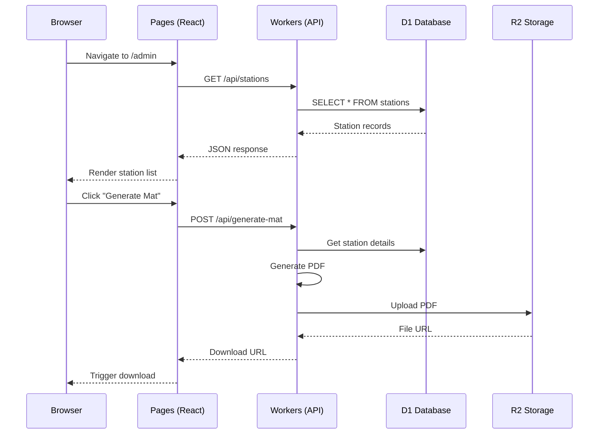

# Design Document

## Overview

HeySalad QC is a full-stack web application built on Cloudflare's edge platform for managing quality control stations in food service operations. The system provides a station management admin panel, QR code mat generator with PDF export, and real-time station dashboards with mock detection capabilities.

The architecture leverages Cloudflare Workers for serverless API endpoints, D1 for SQLite database storage, R2 for PDF file storage, and Pages for hosting the React frontend. This edge-first approach ensures low latency globally and simplified deployment.

## Architecture

```mermaid
graph TB
    subgraph "Cloudflare Edge"
        Pages[Cloudflare Pages<br/>React Frontend]
        Workers[Cloudflare Workers<br/>API Endpoints]
        D1[(D1 Database<br/>SQLite)]
        R2[(R2 Storage<br/>PDF Files)]
    end
    
    subgraph "Frontend Routes"
        Admin[/admin<br/>Station Management]
        Generate[/generate<br/>Mat Generator]
        Station[/station/:id<br/>Dashboard]
        Configure[/station/:id/configure<br/>Rules Config]
    end
    
    Browser[Browser Client] --> Pages
    Pages --> Admin
    Pages --> Generate
    Pages --> Station
    Pages --> Configure
    
    Admin --> Workers
    Generate --> Workers
    Station --> Workers
    Configure --> Workers
    
    Workers --> D1
    Workers --> R2
```

### Request Flow



## Components and Interfaces

### Frontend Components

```typescript
// Component hierarchy
App
├── Layout
│   ├── Header (logo, navigation)
│   └── Main content area
├── Pages
│   ├── AdminPage
│   │   ├── StationTable
│   │   │   └── StationCard (per row)
│   │   ├── StationForm (create/edit modal)
│   │   └── BulkActions
│   ├── GeneratePage
│   │   ├── StationSelector
│   │   ├── LayoutPicker
│   │   ├── MatPreview
│   │   └── DownloadButton
│   ├── StationDashboard
│   │   ├── StationHeader
│   │   ├── CameraFeed
│   │   ├── DetectionOverlay
│   │   ├── Checklist
│   │   └── DetectionLog
│   └── ConfigurePage
│       ├── ExpectedItemsList
│       ├── ThresholdSlider
│       ├── ZoneCanvas
│       └── AlertConfig
└── Shared Components
    ├── QRCodePreview
    ├── AlertBadge
    ├── Button
    ├── Input
    └── Modal
```

### Component Interfaces

```typescript
// StationCard props
interface StationCardProps {
  station: Station;
  onEdit: (id: string) => void;
  onDelete: (id: string) => void;
  onGenerateMat: (id: string) => void;
}

// MatPreview props
interface MatPreviewProps {
  station: Station;
  layout: '1x1' | '2x1' | '2x2';
  showQRCode: boolean;
}

// CameraFeed props
interface CameraFeedProps {
  width: number;
  height: number;
  detections?: Detection[];
  showOverlay: boolean;
}

// Checklist props
interface ChecklistProps {
  expected: string[];
  detected: DetectedObject[];
  showStatus: boolean;
}

// DetectionLog props
interface DetectionLogProps {
  logs: DetectionLogEntry[];
  maxEntries: number;
  onViewDetails: (id: string) => void;
}

// AlertBadge props
interface AlertBadgeProps {
  status: 'pass' | 'fail' | 'warning';
  label?: string;
}
```

### API Interfaces

```typescript
// Worker API handler interface
interface APIHandler {
  fetch(request: Request, env: Env, ctx: ExecutionContext): Promise<Response>;
}

// Environment bindings
interface Env {
  DB: D1Database;
  STORAGE: R2Bucket;
  ALLOWED_ORIGINS: string;
}

// API route handlers
interface StationAPI {
  list(): Promise<Station[]>;
  get(id: string): Promise<Station | null>;
  create(data: CreateStationInput): Promise<Station>;
  update(id: string, data: UpdateStationInput): Promise<Station>;
  delete(id: string): Promise<void>;
}

interface MatGeneratorAPI {
  generate(stationId: string, layout: MatLayout): Promise<string>; // Returns URL
}

interface DetectionAPI {
  process(stationId: string, imageData: string): Promise<DetectionResult>;
  getLogs(stationId: string, limit?: number): Promise<DetectionLogEntry[]>;
  getRules(stationId: string): Promise<DetectionRules | null>;
  updateRules(stationId: string, rules: DetectionRulesInput): Promise<DetectionRules>;
}
```

## Data Models

```typescript
// Station model
interface Station {
  id: string;           // UUID
  name: string;         // e.g., "Packing Station 1"
  type: StationType;    // 'packing' | 'prep' | 'storage' | 'receiving'
  location: string | null;
  description: string | null;
  qr_code_url: string | null;
  created_at: string;   // ISO 8601 datetime
  updated_at: string;   // ISO 8601 datetime
}

type StationType = 'packing' | 'prep' | 'storage' | 'receiving';

// Input types for create/update
interface CreateStationInput {
  name: string;
  type: StationType;
  location?: string;
  description?: string;
}

interface UpdateStationInput {
  name?: string;
  type?: StationType;
  location?: string;
  description?: string;
}

// Detection rules model
interface DetectionRules {
  id: string;
  station_id: string;
  expected_items: ExpectedItem[];
  confidence_threshold: number;  // 0.0 - 1.0
  alert_config: AlertConfig;
  created_at: string;
}

interface ExpectedItem {
  label: string;
  required: boolean;
  min_confidence?: number;
}

interface AlertConfig {
  enabled: boolean;
  email?: string;
  slack_webhook?: string;
  sms?: string;
  triggers: AlertTrigger[];
}

type AlertTrigger = 'missing_item' | 'low_confidence' | 'all_failures';

// Detection log model
interface DetectionLogEntry {
  id: string;
  station_id: string;
  detected_items: DetectedObject[];
  confidence_scores: Record<string, number>;
  pass_fail: 'pass' | 'fail';
  image_url: string | null;
  timestamp: string;
}

interface DetectedObject {
  label: string;
  confidence: number;
  bbox: [number, number, number, number];  // [x, y, width, height]
}

// Detection result (API response)
interface DetectionResult {
  detected_objects: DetectedObject[];
  expected_objects: string[];
  timestamp: string;
  pass: boolean;
  missing: string[];
}

// Mat generation
type MatLayout = '1x1' | '2x1' | '2x2';

interface MatGenerationRequest {
  station_id: string;
  layout: MatLayout;
}

interface MatGenerationResponse {
  url: string;
  filename: string;
}
```

### Database Schema

```sql
-- Stations table
CREATE TABLE stations (
  id TEXT PRIMARY KEY,
  name TEXT NOT NULL,
  type TEXT NOT NULL CHECK (type IN ('packing', 'prep', 'storage', 'receiving')),
  location TEXT,
  description TEXT,
  qr_code_url TEXT,
  created_at DATETIME DEFAULT CURRENT_TIMESTAMP,
  updated_at DATETIME DEFAULT CURRENT_TIMESTAMP
);

-- Detection rules table
CREATE TABLE detection_rules (
  id TEXT PRIMARY KEY,
  station_id TEXT NOT NULL REFERENCES stations(id) ON DELETE CASCADE,
  expected_items TEXT NOT NULL,  -- JSON array
  confidence_threshold REAL DEFAULT 0.75 CHECK (confidence_threshold >= 0 AND confidence_threshold <= 1),
  alert_config TEXT,  -- JSON object
  created_at DATETIME DEFAULT CURRENT_TIMESTAMP,
  UNIQUE(station_id)
);

-- Detection logs table
CREATE TABLE detection_logs (
  id TEXT PRIMARY KEY,
  station_id TEXT NOT NULL REFERENCES stations(id) ON DELETE CASCADE,
  detected_items TEXT NOT NULL,  -- JSON array
  confidence_scores TEXT,  -- JSON object
  pass_fail TEXT NOT NULL CHECK (pass_fail IN ('pass', 'fail')),
  image_url TEXT,
  timestamp DATETIME DEFAULT CURRENT_TIMESTAMP
);

-- Indexes for performance
CREATE INDEX idx_detection_logs_station ON detection_logs(station_id);
CREATE INDEX idx_detection_logs_timestamp ON detection_logs(timestamp DESC);
```


## Correctness Properties

*A property is a characteristic or behavior that should hold true across all valid executions of a system-essentially, a formal statement about what the system should do. Properties serve as the bridge between human-readable specifications and machine-verifiable correctness guarantees.*

### Property 1: Station CRUD Round-Trip Consistency

*For any* valid station input data, creating a station and then retrieving it by ID should return a station with equivalent name, type, location, and description values.

**Validates: Requirements 1.1, 5.2**

### Property 2: Station Update Persistence

*For any* existing station and valid update data, updating the station and then retrieving it should reflect all updated field values.

**Validates: Requirements 1.3, 5.3**

### Property 3: Station Deletion Completeness

*For any* existing station, after deletion, attempting to retrieve the station should return null/not found, and associated detection rules should also be removed.

**Validates: Requirements 1.4, 5.4**

### Property 4: QR Code URL Format Correctness

*For any* station with a valid UUID, the generated QR code should decode to exactly `https://qc.heysalad.app/station/{station_id}` where `{station_id}` matches the station's ID.

**Validates: Requirements 2.4**

### Property 5: Detection Checklist Correctness

*For any* set of expected items and detected items, the checklist should mark an item as "found" if and only if it appears in both sets, and mark an item as "missing" if and only if it appears in expected but not in detected.

**Validates: Requirements 3.4, 4.3**

### Property 6: Confidence Threshold Validation

*For any* confidence threshold value, the system should accept values in the range [0.0, 1.0] inclusive and reject values outside this range.

**Validates: Requirements 4.2**

### Property 7: Detection Log Station Filtering

*For any* station ID, retrieving detection logs should return only logs where the station_id matches the requested station, and the result count should not exceed the specified limit (default 20).

**Validates: Requirements 3.5, 5.7**

### Property 8: Data Model Serialization Round-Trip

*For any* valid Station, DetectionRules, or DetectionResult object, serializing to JSON and then deserializing should produce an object equivalent to the original.

**Validates: Requirements 8.5**

### Property 9: API Request Validation

*For any* API request body with missing required fields or invalid JSON, the system should reject the request with an appropriate error response rather than processing it.

**Validates: Requirements 8.3**

### Property 10: Timestamp Invariants

*For any* station, the created_at timestamp should be set on creation and never change, while updated_at should be greater than or equal to created_at and should increase on each update.

**Validates: Requirements 7.2, 7.5**

## Error Handling

### API Error Responses

```typescript
interface APIError {
  error: string;
  message: string;
  status: number;
  details?: Record<string, string>;
}

// Standard error responses
const ErrorResponses = {
  NOT_FOUND: { error: 'NOT_FOUND', message: 'Resource not found', status: 404 },
  BAD_REQUEST: { error: 'BAD_REQUEST', message: 'Invalid request data', status: 400 },
  VALIDATION_ERROR: { error: 'VALIDATION_ERROR', message: 'Validation failed', status: 422 },
  INTERNAL_ERROR: { error: 'INTERNAL_ERROR', message: 'Internal server error', status: 500 },
};
```

### Error Handling Strategy

1. **Input Validation**: Validate all API inputs before processing. Return 400/422 for invalid data.
2. **Database Errors**: Catch D1 errors, log them, return 500 with generic message.
3. **Storage Errors**: Catch R2 errors during PDF upload, retry once, then return 500.
4. **Not Found**: Return 404 for non-existent stations or resources.
5. **Frontend Errors**: Display user-friendly error messages with retry options.

### Validation Rules

```typescript
const StationValidation = {
  name: { required: true, minLength: 1, maxLength: 100 },
  type: { required: true, enum: ['packing', 'prep', 'storage', 'receiving'] },
  location: { required: false, maxLength: 200 },
  description: { required: false, maxLength: 500 },
};

const DetectionRulesValidation = {
  expected_items: { required: true, type: 'array', minItems: 0 },
  confidence_threshold: { required: false, min: 0.0, max: 1.0, default: 0.75 },
  alert_config: { required: false, type: 'object' },
};
```

## Testing Strategy

### Testing Framework

- **Unit Tests**: Vitest for fast unit testing
- **Property-Based Tests**: fast-check library for property-based testing
- **Integration Tests**: Miniflare for Cloudflare Workers testing
- **Component Tests**: React Testing Library for UI components

### Dual Testing Approach

Both unit tests and property-based tests are essential:
- **Unit tests** verify specific examples, edge cases, and error conditions
- **Property tests** verify universal properties that should hold across all inputs
- Together they provide comprehensive coverage

### Unit Test Coverage

1. **API Handlers**: Test each endpoint with valid/invalid inputs
2. **Data Validation**: Test validation functions with edge cases
3. **PDF Generation**: Test mat layout calculations
4. **QR Code Generation**: Test URL encoding
5. **Detection Logic**: Test checklist comparison logic

### Property-Based Test Coverage

Each correctness property will have a corresponding property-based test:

1. **Property 1 Test**: Generate random station inputs, create, retrieve, verify equivalence
2. **Property 2 Test**: Generate random stations and updates, verify persistence
3. **Property 3 Test**: Generate random stations, delete, verify removal
4. **Property 4 Test**: Generate random UUIDs, verify QR code URL format
5. **Property 5 Test**: Generate random expected/detected item sets, verify checklist logic
6. **Property 6 Test**: Generate random numbers, verify threshold acceptance/rejection
7. **Property 7 Test**: Generate random logs for multiple stations, verify filtering
8. **Property 8 Test**: Generate random data models, verify serialization round-trip
9. **Property 9 Test**: Generate invalid request bodies, verify rejection
10. **Property 10 Test**: Generate stations with updates, verify timestamp invariants

### Test Configuration

```typescript
// fast-check configuration
const fcConfig = {
  numRuns: 100,  // Minimum 100 iterations per property
  seed: Date.now(),
  verbose: true,
};
```

### Test File Structure

```
src/
├── lib/
│   ├── validation.ts
│   ├── validation.test.ts        # Unit tests
│   └── validation.property.test.ts  # Property tests
├── workers/
│   ├── api.ts
│   └── api.test.ts
└── components/
    ├── Checklist.tsx
    └── Checklist.test.tsx
```

### Test Annotations

Each property-based test must include a comment referencing the design document:

```typescript
// **Feature: heysalad-qc, Property 1: Station CRUD Round-Trip Consistency**
test.prop([stationInputArbitrary], (input) => {
  // Test implementation
});
```
